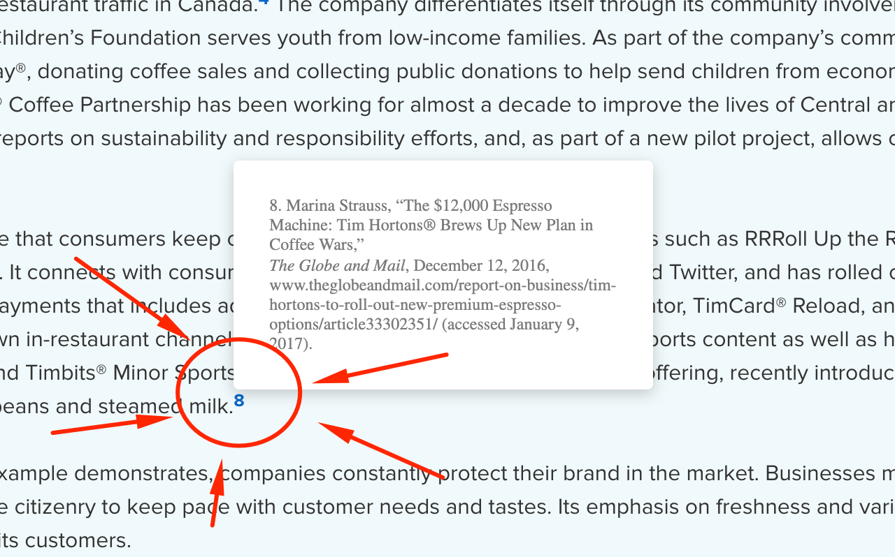
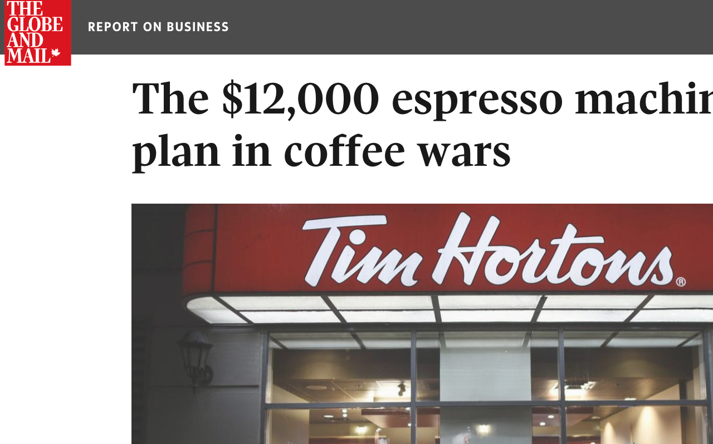
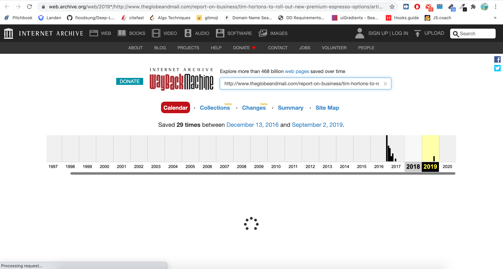

### McGraw-Hill Citation Link
<a href="https://chrome.google.com/webstore/detail/flhalnmbddjilmhcffnpcnnbjpbnigdp"><h1>DOWNLOAD IT ON THE CHROME WEB STORE</h1></a>

&nbsp;

# WHEN YOU CLICK IT........

# IT LINKS YOU TO THE PAGE!!!!!

### also, if you hold Ctrl while clicking it brings you to wayback machine (comes in handy when the citation is from 10 years ago)

